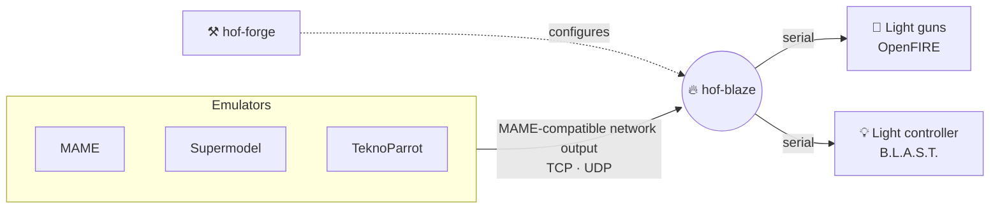
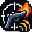
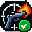
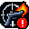

<p align="center">
  
</p>

<h1 align="center">Hooks on Fire</h1>

<p align="center">
  <strong>Your emulator fires. Your light gun kicks. Your cabinet lights up.</strong><br>
  Emulator output → recoil, rumble, LEDs and cabinet lamps. On Windows, Linux and macOS.
</p>

<p align="center">
  <a href="https://github.com/tbreckle/hooks_on_fire/actions/workflows/ci.yml"></a>
  <a href="https://github.com/tbreckle/hooks_on_fire/releases/latest"></a>
  <a href="https://github.com/tbreckle/hooks_on_fire/releases"></a>
  <a href="LICENSE"></a>
  <br>
  
  <a href="rust-toolchain.toml"></a>
  <a href="https://slint.dev"></a>
</p>

<p align="center">
  <a href="#-quick-start"><b>Quick start</b></a> ·
  <a href="https://github.com/tbreckle/hooks_on_fire/releases/latest"><b>Download</b></a> ·
  <a href="docs/user/README.md"><b>Documentation</b></a> ·
  <a href="#-building-from-source"><b>Build</b></a> ·
  <a href="CHANGELOG.md"><b>Changelog</b></a>
</p>

---

Hooks on Fire listens to the **MAME-compatible network output** that emulators send while a
game is running (lamps, recoil, damage, …) and turns it into commands for serial devices such as
[OpenFIRE](https://github.com/TeamOpenFIRE) light guns or light controllers. Every shot, hit and
flashing start button in the game becomes real feedback on your hardware.



Two small programs, one job each:

| | Program | What it does |
|:-:|---|---|
| 🔥 | **hof-blaze** | Runs in the system tray while you play and drives your devices. |
| ⚒️ | **hof-forge** | Configuration editor for your devices, USB ports, players and network settings. |

## ✨ Features

<table>
<tr>
<td width="50%" valign="top">

### 🎯 Player-aware routing
Up to 4 players: player 1's recoil fires player 1's gun, never player 2's.

</td>
<td width="50%" valign="top">

### 🎮 Per-game configuration
Map any output signal of a game to device commands, per player, in a plain YAML file.

</td>
</tr>
<tr>
<td valign="top">

### 🔌 Plug and play USB
Devices are recognised by USB id and serial number. `COM3` became `COM5`? Nothing to reconfigure.

</td>
<td valign="top">

### 🪄 Learns new games
Unknown games and signals are added to the game files automatically, ready to edit.

</td>
</tr>
<tr>
<td valign="top">

### 🔁 Auto-fire and repeats
Commands repeat while the trigger is held – full auto recoil, even when the game only reports "pressed".

</td>
<td valign="top">

### 🚦 Always know what's going on
Tray icon shows the connection state and the running game, plus a log file and clear error dialogs.

</td>
</tr>
</table>

## 🕹️ Supported out of the box

**Sources** – MAME, Supermodel, TeknoParrot, and any other program that sends
MAME-compatible network output ([setup](docs/user/network-output.md)).

**Devices** – [OpenFIRE](https://github.com/TeamOpenFIRE) light guns and the B.L.A.S.T. light
controller. Anything else that speaks serial can be added with a small
[device file](docs/user/device-files.md).

<details>
<summary><b>Games with shipped game files</b></summary>

| Game | Game name |
|---|---|
| Aliens Armageddon | `aa` |
| Daytona USA 2: Power Edition | `dayto2pe` |
| Jurassic Park (2015) | `jp` |
| L.A. Machineguns: Rage of the Machines | `lamachin` |
| The Lost World: Jurassic Park | `lostwsga` |
| The Ocean Hunter | `oceanhuna` |
| Terminator 2: Judgment Day | `term2` |
| Terminator Salvation | `ts` |

Other games work too: hof-blaze creates their [game file](docs/user/game-files.md) on first start.

</details>

## 🚀 Quick start

1. **Download** the archive for your system from the
   [latest release](https://github.com/tbreckle/hooks_on_fire/releases/latest) and unpack it.
2. **Configure** – start **hof-forge**, add your devices and select their USB ports.
3. **Enable output** – turn on the network output of your emulator (MAME: `-output network`).
4. **Play** – close hof-forge, start **hof-blaze** and fire away.

The tray icon tells you where you are:

| | Status | Meaning |
|:-:|---|---|
|  | Waiting | No emulator connected (not running, or network output off) |
|  | Healthy | Connected, shows the running game |
|  | Faulty | The connection failed, see the log file |

> [!TIP]
> Using other hardware? Put its device file into your user folder, see the
> [installation guide](docs/user/installation.md#your-files).

## 📚 Documentation

| | |
|---|---|
| 📦 [Installation](docs/user/installation.md) | Download, folder layout, where your files live |
| 📡 [Network output](docs/user/network-output.md) | Setting up MAME, Supermodel, TeknoParrot |
| ⚒️ [hof-forge](docs/user/hof-forge.md) | Devices, players, settings, keyboard shortcuts |
| 🔥 [hof-blaze](docs/user/hof-blaze.md) | Tray icon, what happens during a game, log file |
| 🎮 [Game files](docs/user/game-files.md) | Signals, commands, repeats, suppression |
| 🔌 [Device files](docs/user/device-files.md) | Adding your own hardware |
| 🩺 [Troubleshooting](docs/user/troubleshooting.md) | When nothing happens |
| 🛠️ [Developer docs](docs/developer/README.md) | Workflow, CI, releases |

## 🔨 Building from source

<details>
<summary>Hooks on Fire is written in Rust 🦀 – click to expand</summary>

On Linux, install the build dependencies first:

```bash
sudo apt-get install -y libgtk-3-dev libxdo-dev libayatana-appindicator3-dev libudev-dev
```

The Rust version is pinned in `rust-toolchain.toml`; [rustup](https://rustup.rs) installs it
automatically. Then build and run:

```bash
cargo build --workspace --release
cargo run -p hof-forge    # config editor
cargo run -p hof-blaze    # background program
```

</details>

## 🤝 Contributing

Contributions are welcome – new game files, device files, bug reports and code. The project uses
GitFlow: branch off `develop` and open a pull request against it, and add your change to
[CHANGELOG.md](CHANGELOG.md). See the [development workflow](docs/developer/gitflow.md) for
branches, releases and versioning.

## 📄 License

Hooks on Fire is released under the [MIT License](LICENSE).

hof-forge uses [Slint](https://slint.dev) under the
[Slint Royalty-free Desktop, Mobile, and Web Applications License 2.0](LICENSES/LicenseRef-Slint-Royalty-free-2.0.md).

<a href="https://slint.dev">
  <picture>
    <source media="(prefers-color-scheme: dark)" srcset="https://slint.dev/logo/MadeWithSlint-logo-dark.svg">
    
  </picture>
</a>

<p align="center"><sub>Made with 🔥 for light gun fans.</sub></p>
